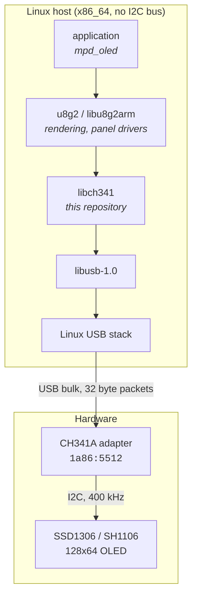
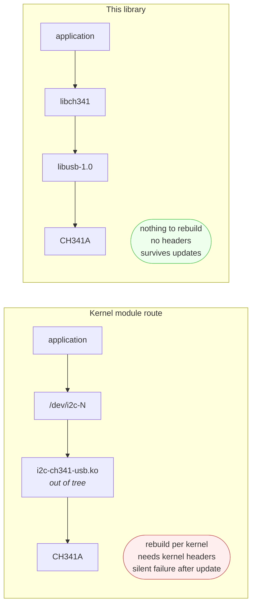

# ch341-i2c-usb

Drive an I2C display from a Linux host that has no I2C bus, using a WCH
CH341A USB adapter and a userspace transport.

No kernel module. No kernel headers. Nothing pinned to a kernel version,
and nothing that breaks when the system is updated.



## Why this exists

The CH341A is a cheap and widely available USB to I2C bridge, but Linux
has no in-tree I2C driver for it. Frank Zago's MFD/I2C/GPIO series was
submitted upstream in 2022 and was not merged, so every existing option
is an out-of-tree kernel module.

On an appliance distribution that is a poor trade:



Beyond the maintenance problem, the module in common circulation reports
a device at every address when scanned, so `i2cdetect` cannot be used to
diagnose anything, and loading it while another process holds the
adapter has been observed to deadlock the kernel side.

## Three ways to use this

| | What it is | Start here |
|---|---|---|
| **Library** | `libch341.a` plus a header, for your own application | [Building](#building) below |
| **Volumio plugin** | Prebuilt, installs in one step, includes the spectrum analyser | [ch341_oled/](ch341_oled/) |
| **Manual install** | Build `mpd_oled` from source on a Volumio 4 x86 system | [doc/volumio4-x86-install.md](doc/volumio4-x86-install.md) |
| **Payload build** | Reproducible container build of the plugin binaries | [build/](build/) |

The plugin is the easiest route on Volumio and the only one that gets
the spectrum analyser working. The manual install is useful if you want
to understand the parts or are not on Volumio.

## What the library does and does not do

Implemented:

- Open a specific adapter by index, so more than one can be used
- Set the I2C bus rate: 20, 100, 400 or 750 kHz
- Probe an address, with genuine ACK/NAK reporting
- Write to an address

Not implemented:

- Reads. Write-only is sufficient for displays, which is what this was
  written for. Reads are a straightforward addition if needed.
- GPIO and SPI. The CH341A supports both; this library does not.
- Writes larger than 26 bytes. See below.

## Limits, and one that matters

**Writes cannot be confirmed.** `ch341_i2c_write()` returns whether the
adapter accepted the command, not whether the slave acknowledged.

This is not an oversight. Appending a status read to a data write was
tested against both a populated and an empty address and returned an
identical result, so the acknowledge bit is not available on that path.
It is a property of the chip. Neither existing kernel driver reports it
either.

`ch341_i2c_probe()` **is** reliable, because the address-phase form does
return usable status. Applications that need to know a device is still
present should probe periodically rather than trusting write returns.

**Maximum write is 26 bytes.** The bulk endpoint is 32 bytes and the
command framing costs 6 of them. Larger writes are refused with an error
rather than silently truncated.

## Building

Requires libusb-1.0.

```
sudo apt-get install build-essential libusb-1.0-0-dev
make
```

Produces `libch341.a` and the `ch341_probe` diagnostic tool.

Install the library and header system-wide, if you want them:

```
sudo make install
```

## Permissions

By default the adapter is root-only. Install the supplied udev rule to
avoid running as root:

```
sudo make install-udev
```

Adjust `GROUP` in `udev/60-ch341-i2c.rules` to suit, make sure your user
is a member, and **replug the adapter** — udev rules apply to devices as
they appear.

## Adapter setup

The CH341A presents a different USB product ID depending on how it is
strapped, and the mode is selected by a jumper on the breakout board:

| Mode | USB ID | Handled by |
|---|---|---|
| UART | `1a86:5523` | in-tree `ch341` serial driver |
| I2C / SPI / GPIO | `1a86:5512` | this library |
| Parallel printer | `1a86:5584` | in-tree `usblp` |

This library only finds `1a86:5512`. If `lsusb` reports `5523`, move the
mode jumper — on the common DollaTek and WWZMDiB boards the I2C position
lights the red LED and UART lights the blue one.

Set the voltage jumpers to match your panel. Most 0.96 inch SSD1306
breakouts want 3.3 V. Both jumpers move together.

## Usage

```c
#include "ch341.h"

char err[160];
ch341_dev *dev = ch341_open(0, err, sizeof(err));
if (!dev) {
    fprintf(stderr, "%s\n", err);
    return 1;
}

ch341_set_speed(dev, CH341_SPEED_400K);

/* Find an SSD1306: it answers at 0x3c or 0x3d */
uint8_t addr = 0;
if (ch341_i2c_probe(dev, 0x3c) == 1)      addr = 0x3c;
else if (ch341_i2c_probe(dev, 0x3d) == 1) addr = 0x3d;

if (addr) {
    /* charge pump on, display on, all pixels on */
    const uint8_t on[] = { 0x00, 0x8d, 0x14, 0xaf, 0xa5 };
    ch341_i2c_write(dev, addr, on, sizeof(on));
}

ch341_close(dev);
```

Link with `-lch341 -lusb-1.0`.

Note the charge pump command. An SSD1306 comes out of reset with the
display off and the charge pump disabled, and generic breakouts have no
external panel supply, so `0x8d 0x14` is required before anything can
light. It is on page 62 of the datasheet and easy to miss.

## The probe tool

`ch341_probe` is the diagnostic that established the write-status
limitation, kept here because it is a useful bring-up tool. It runs two
tests against a present and an absent address and prints the raw bytes
in both directions.

```
sudo ./ch341_probe          # defaults: 0x3c present, 0x50 absent
sudo ./ch341_probe 3d 50    # override
```

Unload any CH341 kernel module first — two drivers on one adapter is the
deadlock case:

```
sudo rmmod i2c-ch341-usb
```

## Performance

Measured driving a 128x64 SSD1306 through mpd_oled on an Intel Jasper
Lake host:

| Bus rate | Full frames per second |
|---|---|
| 100 kHz | roughly 8 |
| 400 kHz | roughly 26 |

A full frame is 1024 bytes, sent as 8 pages of 6 transactions each. The
bus is the constraint, not the host, so the rate setting matters a great
deal for display work. This library defaults to 400 kHz for that reason.

USB transfer completion is decoupled from I2C completion, so timing a
single transfer tells you nothing useful about throughput. Only
sustained measurement does.

## Protocol

The wire protocol is documented in [doc/protocol.md](doc/protocol.md).
It was captured with `usbmon` from a working system and decoded byte by
byte, rather than taken from a datasheet.

## Related

[foonerd/libu8g2arm](https://github.com/foonerd/libu8g2arm/tree/feat/ch341-usb-transport)
— a fork of antiprism's u8g2 port with this transport added, so u8g2
applications can use a CH341A with no code changes beyond a device
string. Also adds an `xoffset=` override for panels whose visible area
starts partway into controller memory, and fixes `i2c_address=` having
no effect.

[foonerd/mpd_oled_dev](https://github.com/foonerd/mpd_oled_dev/tree/feat/volumio-x86)
— a fork of antiprism's mpd_oled development branch carrying the x86
work: the `-L` layout option, a `-u` option for the player status
polling interval, and a fix so the Volumio path no longer requires an
MPD connection.

## Licence

MIT. See [LICENSE](LICENSE).

The protocol constants are common to several prior implementations, in
particular the work of Till Harbaum, Marco Gittler, Tse Lun Bien, Gunar
Schorcht and Frank Zago. This is an independent implementation, but
their drivers were valuable references and are acknowledged here.
