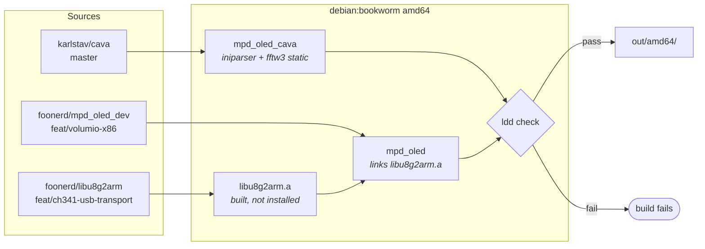

# Containerised build

Builds the `ch341_oled` plugin payload: `mpd_oled` and `mpd_oled_cava`,
for amd64, in one Docker run.

```
./docker/run-docker-mpd_oled.sh amd64
```

Output lands in `out/amd64/`. Copy it into the plugin:

```
cp out/amd64/* ../ch341_oled/bin/
```

Add `--verbose` to see the compile output.

## Why a container

Three reasons, in order of how much they cost when ignored.

**A build host lies about dependencies.** The `-dev` packages needed to
compile also install their runtime libraries, so a binary that works on
the machine that built it can fail on a clean target. That is exactly
what happened once: `mpd_oled_cava` reached a field tester linked
against `libfftw3`, which is not on a stock Volumio image, and failed on
first run. The container is built from `debian:bookworm` with a known
package list, and the build verifies the result rather than assuming.

**Reproducibility.** The artefact is defined by three git refs and a
Dockerfile, not by whatever happened to be installed on someone's
development machine.

**The right glibc.** Bookworm amd64 matches Volumio 4's base, so the
binaries link against the glibc the target actually has.

## What it builds



## Static linking without patching Makefiles

`libiniparser` and `libfftw3` are not on a stock Volumio image, so cava
must carry them.

Libtool silently reorders `-Wl,-Bstatic` away, so the usual flag does
nothing. Some builds work around this by running `sed` over the
generated Makefiles to replace `-lfftw3` with a path. That works, but it
depends on the shape of a file the build system generates, and breaks
whenever upstream changes it.

Instead the archive is named by full path in `LIBS=` at configure time:

```
./configure ... LIBS="/usr/lib/.../libiniparser.a /usr/lib/.../libfftw3.a"
```

Autotools appends `LIBS` to the end of the link line, and a path is an
input file to the linker rather than a flag it can reorder. Nothing
generated is touched.

The paths are located with `find` rather than hardcoded, so a different
architecture or a Debian layout change does not break it.

## Verification

The build fails if either binary links a library that is not on a stock
Volumio image. Present on a stock image and therefore allowed:

| Library | Arrives via |
|---|---|
| `libmpdclient2` | `mpc`, in the Volumio package set |
| `libusb-1.0-0` | `usbutils`, in the Volumio package set |
| `libasound2` | explicit in `VolumioBase.conf` |
| `libudev`, `libm`, `libgcc_s`, `libpthread`, `libc` | base system |

The authority on this is
`volumio-os/recipes/base/VolumioBase.conf`, not a machine that has been
built on.

## Building a different branch

Override the refs in the environment to test a change before pushing it:

```
MPD_OLED_REF=fix/something ./docker/run-docker-mpd_oled.sh amd64
```

`LIBU8G2_REPO`, `LIBU8G2_REF`, `MPD_OLED_REPO`, `MPD_OLED_REF`,
`CAVA_REPO` and `CAVA_REF` are all overridable.

## Other architectures

Only amd64 is supported. The CH341 route exists because x86 hosts have
no I2C bus; ARM boards have GPIO I2C and are served by the upstream
`mpd_oled` plugin.

The architecture argument and the platform tables in
`run-docker-mpd_oled.sh` are kept so that adding a target is a table
entry and a Dockerfile rather than a rewrite.

## Layout

```
build/
├── docker/
│   ├── Dockerfile.mpd_oled.amd64
│   └── run-docker-mpd_oled.sh    host side: image, platform, volumes
├── scripts/
│   └── build-mpd_oled.sh         container side: clone, build, verify
└── out/amd64/                    output, not tracked in git
```
