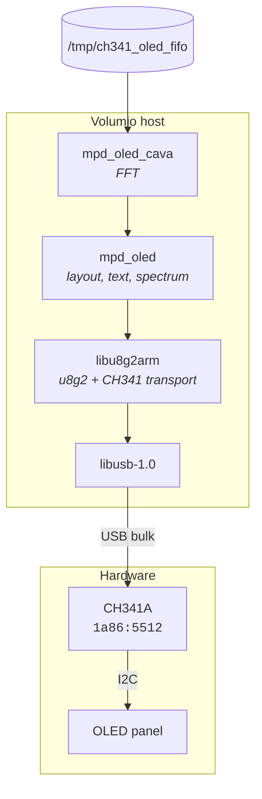
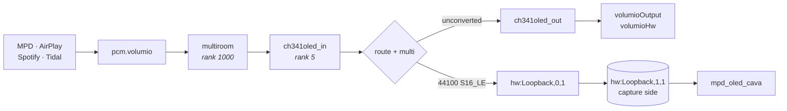
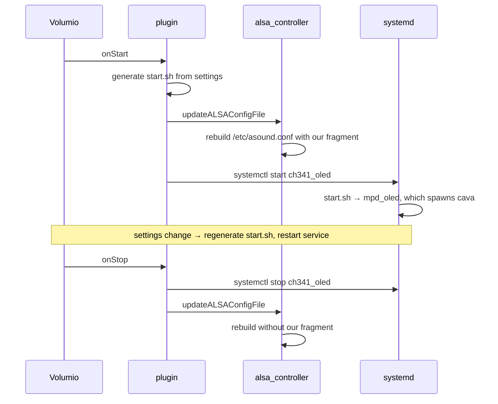

# CH341 OLED — Volumio plugin

Drives an I2C OLED panel through a WCH CH341A USB adapter on x86 Volumio
systems, which have no usable I2C bus of their own.

No kernel module, no compilation on the device, and no apt at install
time. Nothing it installs is disturbed by a system update.

> **Prototype.** Working and tested on Volumio 4.143 / amd64, but not in
> the plugin store and not widely exercised.

## What you need

| | |
|---|---|
| Host | x86_64 Volumio 4 (Bookworm) |
| Adapter | CH341A USB module, jumper set to **I2C/SPI** — red LED, `lsusb` reports `1a86:5512` |
| Panel | I2C OLED supported by u8g2 — SSD1306, SH1106 and others |
| Wiring | Four wires, label to label: GND, VCC, SDA, SCL |

Set the adapter's voltage jumpers to match your panel. Most 0.96 inch
SSD1306 breakouts want 3.3 V, and both jumpers move together.

## Install

```
git clone --depth=1 https://github.com/foonerd/ch341-i2c-usb.git
cd ch341-i2c-usb/ch341_oled
volumio plugin install
```

Then enable it under **Plugins → Installed plugins**.

If a CH341 kernel module was installed previously, the installer removes
it. Two drivers contending for one adapter can deadlock the kernel.

## Settings

**Panel model** — controller and model as listed by `mpd_oled -o help`.
Start with `SSD1306,128X64_NONAME`. Many panels sold as SSD1306 are in
fact SH1106, so try `SH1106,128X64_NONAME` if the image is poor.

**Column offset** — if the first character on a line is clipped at the
left edge, the panel's visible area starts partway into the controller's
memory. Try 1, 2 and 3. This varies between panels sold under the same
name; the development panel needed 2.

**I2C address** — leave empty for 0x3c, set `3d` if your panel uses the
alternate address.

**Bus speed** — 400 kHz by default, roughly three times the frame rate
of 100 kHz. Reduce it if long leads or weak pull-up resistors make the
display unreliable.

## How it works



The display path needs no kernel driver: `libu8g2arm` was forked to add
a transport that speaks to the adapter over libusb directly. The device
string carries `ch341=0` instead of a bus number.

## The audio tap

The spectrum needs a copy of the playback stream. The plugin declares
`has_alsa_contribution` and ships an ALSA fragment, which Volumio's
backend splices into the generated chain. **`/etc/mpd.conf` is never
edited**, so the system integrity check is not disturbed and updates are
unaffected.



Because the split happens at the ALSA layer rather than inside MPD, the
spectrum works for **every** source — AirPlay, Spotify Connect, Tidal
Connect and webradio, not only MPD.

Three details in the fragment are not obvious and all three cost time to
arrive at.

The tap terminates at `hw:Loopback` rather than at a userspace FIFO
plugin. A `multi` must find hardware parameters satisfying both of its
branches at once, and a userspace plugin's buffer constraints entering
that negotiation can leave no valid configuration on a device with rigid
period sizing — a USB DAC behind a software mixer was the reported case,
and ALSA aborts the caller outright. `snd_aloop` negotiates flexibly and
follows the output device instead of fighting it. This is the terminus
the peppyspectrum and peppymeterbasic plugins use on amd64.

The `multi` is deliberately **not** pinned to a fixed rate. Pinning it
would also avoid the negotiation problem, but forces both branches to
that rate and would downsample all playback.

The tap branch alone is pinned to 44100/S16_LE/2, because cava reads the
loopback capture side and cannot follow a rate that changes per track.

## Lifecycle



The tap terminates at an ALSA loopback device that already exists on a
stock system, so there is nothing for the plugin to create before the
chain will resolve.

## What gets installed

```
/usr/local/bin/mpd_oled                    display program
/usr/local/bin/mpd_oled_cava               spectrum calculation
/etc/udev/rules.d/60-ch341-i2c.rules       device permissions
/etc/sudoers.d/volumio-ch341_oled          service control, scoped to this unit
/etc/systemd/system/ch341_oled.service     the unit
```

Nothing under `/boot`, nothing in `/lib/modules`, and no system
configuration file modified. Uninstalling removes all of it.

The payload is prebuilt and links only against libraries present on a
stock image, with `libiniparser` and `libfftw3` statically linked into
cava. So the install needs no network and cannot drift with package
versions.

## Troubleshooting

**`cannot open adapter: LIBUSB_ERROR_ACCESS`** — the udev rule has not
taken effect. Unplug and replug the adapter.

**`no CH341 adapter at index 0`** — the adapter is in UART mode. Move
the mode jumper and check `lsusb | grep 1a86` reports `5512`.

**First character clipped** — set the column offset. Try 1, 2 and 3.

**Blurred or wrong-looking text** — try a different panel model. The
SH1106 variants are worth trying even if the panel was sold as SSD1306.

**No spectrum bars** — confirm something is playing, then check cava
started:

```
journalctl -u ch341_oled -n 50 --no-pager | grep -i cava
aplay -l | grep -i loopback
```

**Nothing plays after enabling** — disable the plugin, which rebuilds
the ALSA chain without the fragment and restores audio, then report it.

Note that `i2cdetect` is no help here. There is no kernel I2C bus in
this configuration.

## Building the payload yourself

The binaries in `bin/` are produced by the containerised build in
[../build/](../build/):

```
cd ..
./build/docker/run-docker-mpd_oled.sh amd64
cp build/out/amd64/* ch341_oled/bin/
```

One Docker run builds all three components from source - libu8g2arm with
the CH341 transport, cava, and mpd_oled - and fails if either binary
ends up depending on a library absent from a stock Volumio image.

Sources:
[foonerd/libu8g2arm](https://github.com/foonerd/libu8g2arm/tree/feat/ch341-usb-transport),
[foonerd/mpd_oled_dev](https://github.com/foonerd/mpd_oled_dev/tree/feat/volumio-x86)
and [karlstav/cava](https://github.com/karlstav/cava).

To build on the device by hand instead, or to run `mpd_oled` without the
plugin, see [../doc/volumio4-x86-install.md](../doc/volumio4-x86-install.md).

## Licence

MIT. See [../LICENSE](../LICENSE).

`mpd_oled` is by Adrian Rossiter and contributors; the `-L` layout
option originated in Wheaten's fork. cava is by Karl Stavestrand. The
Volumio plugin conventions and the ALSA contribution pattern follow the
existing `mpd_oled`, `peppyspectrum` and `stylish_player` plugins.
