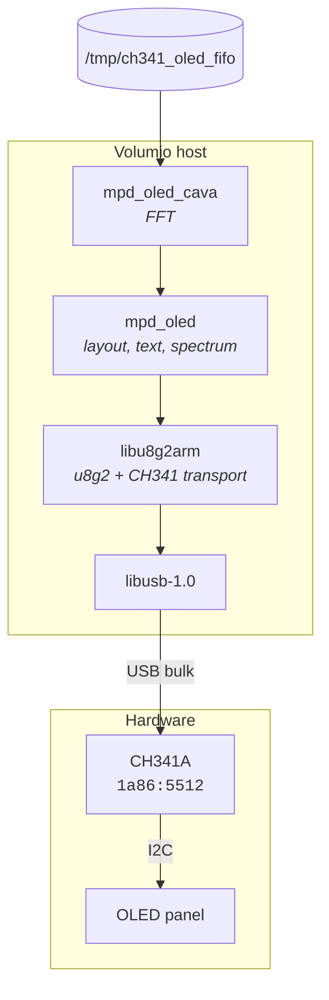
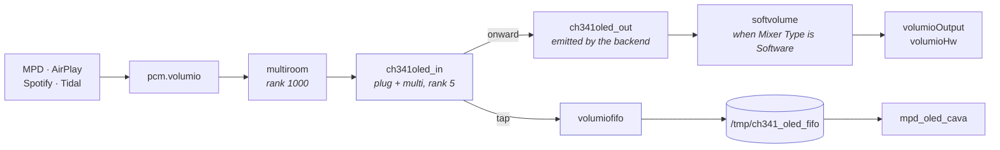
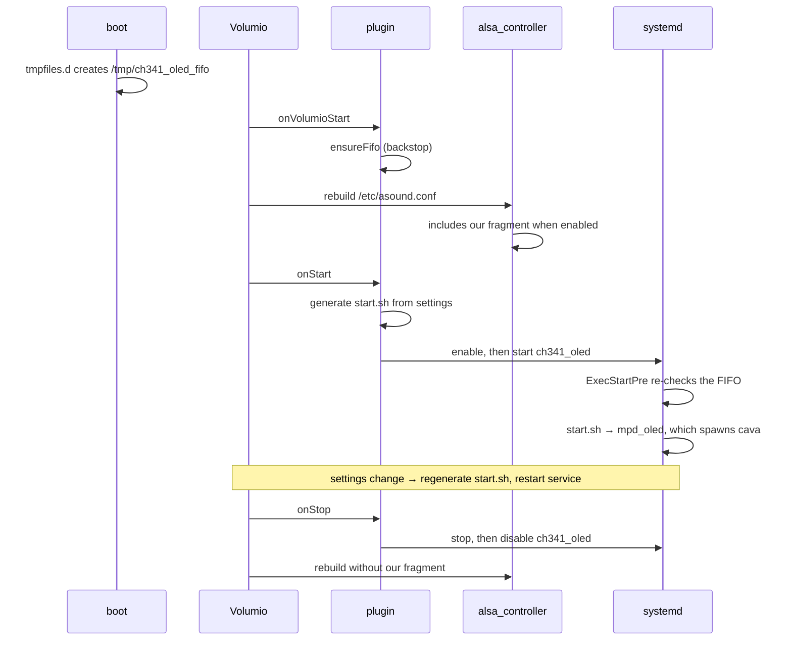

# CH341 OLED — Volumio plugin

Drives an I2C OLED panel through a WCH CH341A USB adapter on x86 Volumio
systems, which have no usable I2C bus of their own.

No kernel module, no compilation on the device, and no apt at install
time. Nothing it installs is disturbed by a system update.

> **Prototype.** Not in the plugin store and not widely exercised.
> Verified on Volumio 4.143 / amd64 with onboard HDA audio, across all
> three Mixer Type settings (Software, Hardware, None), surviving reboot,
> plugin enable and disable, and settings changes.

## What you need

| | |
|---|---|
| Host | x86_64 Volumio 4 (Bookworm) |
| Adapter | CH341A USB module, jumper set to **I2C/SPI** — red LED, `lsusb` reports `1a86:5512` |
| Panel | I2C OLED supported by u8g2 — SSD1306, SH1106 and others |
| Wiring | Four wires, label to label: GND, VCC, SDA, SCL |

Set the adapter's voltage jumpers to match your panel. Most 0.96 inch
SSD1306 breakouts want 3.3 V, and both jumpers move together.

## Install

```
git clone --depth=1 https://github.com/foonerd/ch341-i2c-usb.git
cd ch341-i2c-usb/ch341_oled
volumio plugin install
```

Then enable it under **Plugins → Installed plugins**.

If a CH341 kernel module was installed previously, the installer removes
it. Two drivers contending for one adapter can deadlock the kernel.

## Settings

**Panel model** — controller and model as listed by `mpd_oled -o help`.
Start with `SSD1306,128X64_NONAME`. Many panels sold as SSD1306 are in
fact SH1106, so try `SH1106,128X64_NONAME` if the image is poor.

**Column offset** — if the first character on a line is clipped at the
left edge, the panel's visible area starts partway into the controller's
memory. Try 1, 2 and 3. This varies between panels sold under the same
name; the development panel needed 2.

**I2C address** — leave empty for 0x3c, set `3d` if your panel uses the
alternate address.

**Bus speed** — 400 kHz by default, roughly three times the frame rate
of 100 kHz. Reduce it if long leads or weak pull-up resistors make the
display unreliable.

**Spectrum delay** — the spectrum is measured before the audio output
buffer, so the bars can run ahead of what you hear by however much that
buffer holds. Start at 0 and increase in steps of 100 ms until the bars
land on the beat.

**Spectrum sensitivity** — how tall the bars are for a given signal
level. 100 is the starting point; raise it if the bars are always small,
lower it if they reach the top on ordinary material.

Setting it to 0 hands the decision to cava's automatic sensitivity, and
the plugin does not do that by default for a specific reason. Automatic
adjustment exists because most audio captures sit *after* the volume
control, so their level moves whenever the listener changes volume. This
tap sits *before* the volume stage, at a fixed rate and format, so its
level never varies — there is nothing for automatic adjustment to
follow except the silence between tracks. It reads a gap as a quiet
input, raises the gain, and then cuts back sharply when the music
returns, which shows as the bars filling the display for several seconds
after every pause. Upstream documents the startup case of this in
[karlstav/cava#404](https://github.com/karlstav/cava/issues/404); the
repetition after each gap is the same mechanism.

A fixed value also means a quiet passage looks quiet, instead of being
amplified until it fills the display.

## How it works



The display path needs no kernel driver: `libu8g2arm` was forked to add
a transport that speaks to the adapter over libusb directly. The device
string carries `ch341=0` instead of a bus number.

## The audio tap

The spectrum needs a copy of the playback stream. The plugin declares
`has_alsa_contribution` and ships an ALSA fragment, which Volumio's
backend splices into the generated chain. **`/etc/mpd.conf` is never
edited**, so the system integrity check is not disturbed and updates are
unaffected.



Because the split happens at the ALSA layer rather than inside MPD, the
spectrum works for **every** source — AirPlay, Spotify Connect, Tidal
Connect and webradio, not only MPD.

Three things about the fragment are worth knowing, all of them learned
the hard way.

**One plug, wrapping the multi. Nothing else.** This is the shape the
store `mpd_oled` snippet uses and it is the only one that survives all
three Mixer Type settings. Putting a rate-forcing plug on the tap branch
while the onward branch reaches `softvolume` gives the `multi` two
contradictory format constraints — `S16_LE` against `S24_3LE` — which
intersect to nothing, and ALSA aborts whatever is playing:

```
mpd: pcm_params.c:170: snd1_pcm_hw_param_get_min:
     Assertion `!snd_interval_empty(i)' failed.
```

That fails only with Mixer Type Software, because None and Hardware do
not insert `softvolume` and so nothing contradicts the forced format.

**`volumiofifo`, unwrapped.** Its `format_3`, `format_4` and `format_5`
settings are a width-to-output mapping, not a single-format constraint,
so it is already flexible. Wrapping it in a converting plug is what makes
it rigid. The stock ALSA `file` plugin is not an option — it blocks on
opening a FIFO until a reader attaches, and creates a regular file and
fills it if no FIFO exists.

**`pcm.ch341oled_out` is not defined here.** The backend emits it as
`type empty` and wires it to whatever comes next. Defining it in the
fragment would collide with the chain builder.

## Lifecycle



The ordering matters and is easy to get wrong.

`/tmp` is tmpfs, so the FIFO does not survive a reboot. The fragment
names it whenever the plugin is enabled, and `volumiofifo` does not
create it — if it is missing the whole chain fails to resolve and
playback stops. So it is created three times over: by `tmpfiles.d` at
boot, by `onVolumioStart` as a backstop, and by `ExecStartPre` before the
service runs.

`onStart` is too late. Volumio rebuilds `asound.conf` after
`onVolumioStart` and before `onStart`, on both boot and enable.

An existing FIFO is never replaced, only its mode corrected. ALSA may
already hold the inode after the rebuild, and `rm` followed by `mkfifo`
would leave writers attached to a dead pipe.

The plugin does not call `updateALSAConfigFile` itself. Core already
rebuilds after `onVolumioStart` and after `onStop`; a second call with
identical content skips the player reopen, and a fire-and-forget one
races the service.

The unit is enabled in `onStart` and disabled in `onStop`, so a reboot
starts the display and a disabled plugin stays off.

## What gets installed

```
/usr/local/bin/mpd_oled                    display program
/usr/local/bin/mpd_oled_cava               spectrum calculation
/etc/udev/rules.d/60-ch341-i2c.rules       device permissions
/etc/sudoers.d/volumio-ch341_oled          service control, scoped to this unit
/etc/tmpfiles.d/ch341_oled.conf            recreates the FIFO at boot
/etc/systemd/system/ch341_oled.service     the unit
```

Nothing under `/boot`, nothing in `/lib/modules`, and no system
configuration file modified. Uninstalling removes all of it.

The payload is prebuilt and links only against libraries present on a
stock image, with `libiniparser` and `libfftw3` statically linked into
cava. So the install needs no network and cannot drift with package
versions.

## Troubleshooting

**`cannot open adapter: LIBUSB_ERROR_ACCESS`** — the udev rule has not
taken effect. Unplug and replug the adapter.

**`no CH341 adapter at index 0`** — the adapter is in UART mode. Move
the mode jumper and check `lsusb | grep 1a86` reports `5512`.

**First character clipped** — set the column offset. Try 1, 2 and 3.

**Blurred or wrong-looking text** — try a different panel model. The
SH1106 variants are worth trying even if the panel was sold as SSD1306.

**No spectrum bars** — check the FIFO exists and is a pipe, the leading
character of the mode being `p`:

```
ls -l /tmp/ch341_oled_fifo
```

Then confirm something is playing. If the display updates on track change
but never shows bars, check the journal for cava failing to start:

```
journalctl -u ch341_oled -n 50 --no-pager | grep -i cava
```

**Bars run ahead of the sound** — raise the Spectrum delay setting. The
tap is upstream of the audio output buffer, so this is expected rather
than a fault.

**Bars fill the display for a few seconds after every pause** — the
Spectrum sensitivity setting is 0, which selects automatic adjustment.
Set it to 100 and tune from there. See the setting's description above
for why automatic does not suit this signal path.

**Bars always small, or always at the top** — adjust Spectrum
sensitivity. It is a fixed gain, so it needs setting once for your
system.

**Nothing plays after enabling** — disable the plugin, which rebuilds
the ALSA chain without the fragment and restores audio, then report it.

Note that `i2cdetect` is no help here. There is no kernel I2C bus in
this configuration.

## Building the payload yourself

The binaries in `bin/` are produced by the containerised build in
[../build/](../build/):

```
cd ..
./build/docker/run-docker-mpd_oled.sh amd64
cp build/out/amd64/* ch341_oled/bin/
```

One Docker run builds all three components from source - libu8g2arm with
the CH341 transport, cava, and mpd_oled - and fails if either binary
ends up depending on a library absent from a stock Volumio image.

Sources:
[foonerd/libu8g2arm](https://github.com/foonerd/libu8g2arm/tree/feat/ch341-usb-transport),
[foonerd/mpd_oled_dev](https://github.com/foonerd/mpd_oled_dev/tree/feat/volumio-x86)
and [karlstav/cava](https://github.com/karlstav/cava).

To build on the device by hand instead, or to run `mpd_oled` without the
plugin, see [../doc/volumio4-x86-install.md](../doc/volumio4-x86-install.md).

## Licence

MIT. See [../LICENSE](../LICENSE).

`mpd_oled` is by Adrian Rossiter and contributors; the `-L` layout
option originated in Wheaten's fork. cava is by Karl Stavestrand. The
Volumio plugin conventions and the ALSA contribution pattern follow the
existing `mpd_oled`, `peppyspectrum` and `stylish_player` plugins.
